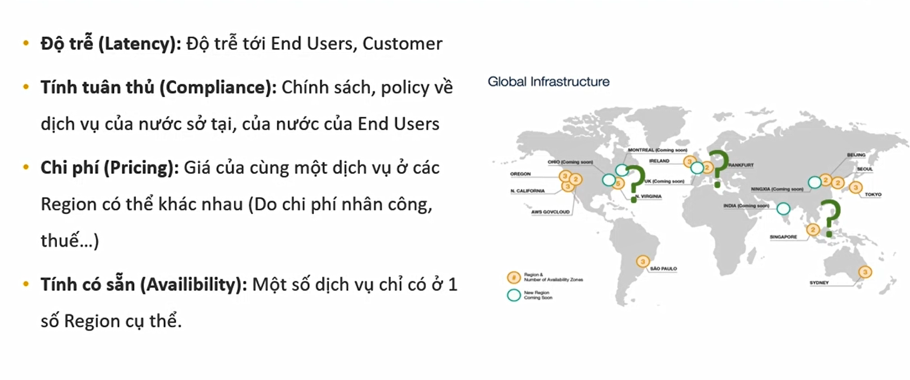

# AWS

# Intro

# Identity Access Management

# S3

# EC2

# DB on AWS

# Route 53

# VPC 

# Design HA & Scalability Architecture

# Monitoring

# Applications

# Serverless

# Container on AWS

# SSA

